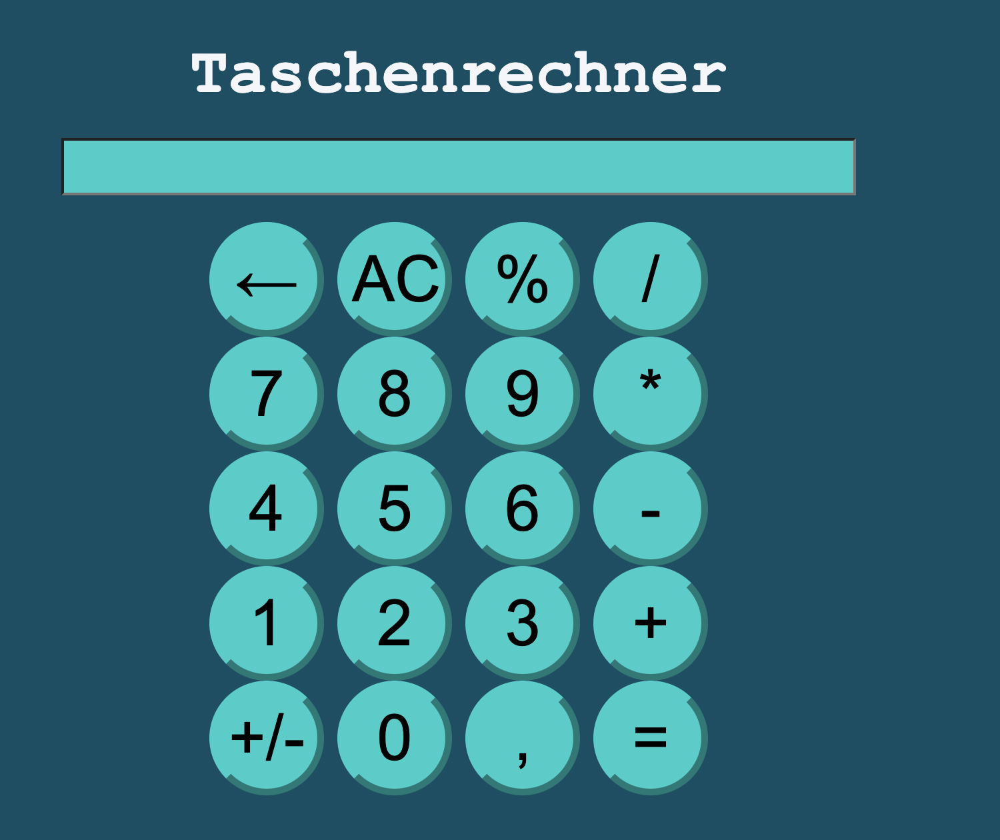

# 🧮 Taschenrechner

Ein moderner Taschenrechner, entwickelt mit **HTML**, **CSS** und **JavaScript**.

Die Anwendung unterstützt grundlegende mathematische Operationen und wurde entwickelt, um den Umgang mit DOM-Manipulation, Event Handling sowie Unit Tests zu vertiefen.

---

## 📸 Vorschau

<p align="center">
    
</p>

---

# 📖 Projektbeschreibung

Dieser Taschenrechner bietet eine intuitive Benutzeroberfläche zur Durchführung grundlegender mathematischer Berechnungen.

Die Eingaben erfolgen über ein eigenes Tastenfeld. Sämtliche Berechnungen werden vollständig in JavaScript verarbeitet. Zusätzlich wurde ein erster Unit Test implementiert, um die Berechnungslogik zu überprüfen.

> [!IMPORTANT]
> Dieses Projekt wurde vollständig mit **Vanilla JavaScript** entwickelt – ohne externe Bibliotheken oder Frameworks.

---

# ✨ Features

- ➕ Addition
- ➖ Subtraktion
- ✖️ Multiplikation
- ➗ Division
- 📊 Prozentrechnung
- ⌫ Löschen der letzten Eingabe
- 🗑️ Komplettes Zurücksetzen (AC)
- 🖥️ Dynamische Anzeige der Eingaben
- ⚡ Schnelle Berechnung
- 🧪 Unit Test für die Berechnungslogik

---

# 🧪 Unit Tests

Zur Verbesserung der Codequalität wurde die Berechnungsfunktion mit dem integrierten **Node.js Test Runner** getestet.

Aktuell wird geprüft:

- ✅ Addition zweier Zahlen
- ✅ Korrekte Rückgabe des Berechnungsergebnisses

Weitere Tests sind bereits geplant.

---

# 🛠️ Verwendete Technologien

| Technologie | Beschreibung |
|-------------|--------------|
| HTML5 | Seitenstruktur |
| CSS3 | Layout und Design |
| JavaScript (ES6) | Berechnungslogik |
| DOM API | Benutzerinteraktion |
| Node.js Test Runner | Unit Tests |

---

# 📂 Projektstruktur

```text
Taschenrechner/
│
├── img/
│   ├── calculator.svg
│   ├── cover.png
│   └── ...
│
├── calculator.js
├── calcu.js
├── script.test.js
├── style.css
├── index.html
├── package.json
└── README.md
```

---

# ⚙️ Installation

Repository klonen

```bash
git clone https://github.com/ITKadirKahraman/taschenrechner.git
```

Projektordner öffnen

```bash
cd taschenrechner
```

Anschließend einfach die **index.html** im Browser öffnen.

---

# ▶️ Unit Tests ausführen

Node.js installieren und anschließend im Projektordner:

```bash
npm install
```

Danach können die Tests gestartet werden:

```bash
npm test
```

---

# 🚀 Live Demo

🌐 **Projekt ausprobieren**

https://itkadirkahraman.github.io/taschenrechner/

💻 **GitHub Repository**

https://github.com/ITKadirKahraman/taschenrechner

---

# 🧩 Projektaufbau

Die Anwendung besteht aus folgenden Komponenten:

- Anzeige (Display)
- Zahlenfeld
- Operatoren
- Berechnungslogik
- Reset-Funktion
- Löschen einzelner Zeichen
- Unit Tests

---

# 🚀 Roadmap

Geplante Erweiterungen:

- [ ] Kommazahlen vollständig unterstützen
- [ ] Klammerberechnung
- [ ] Potenzfunktion
- [ ] Quadratwurzel
- [ ] Tastatureingaben unterstützen
- [ ] Fehlerbehandlung verbessern
- [ ] Weitere Unit Tests
- [ ] Responsive Optimierung

---

> [!TIP]
> Dieses Projekt eignet sich hervorragend, um den Umgang mit JavaScript, DOM-Manipulation und mathematischen Berechnungen zu lernen.

---

> [!NOTE]
> Alle Berechnungen erfolgen vollständig clientseitig im Browser.

---

> [!WARNING]
> Der Taschenrechner ersetzt keine wissenschaftliche Rechensoftware und unterstützt aktuell nur grundlegende mathematische Operationen.

---

> [!CAUTION]
> Die Prozentfunktion befindet sich noch in einer einfachen Implementierung und wird zukünftig erweitert.

---

# 👨‍💻 Autor

**Kadir Kahraman**

Angehender Frontend- & Full-Stack-Entwickler

---

⭐ Vielen Dank für deinen Besuch! Falls dir das Projekt gefällt, freue ich mich über einen ⭐ auf GitHub.